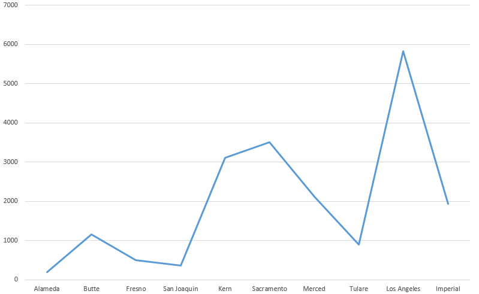

# Java-project

1. Скачиваем csv-файл
2. Создаём java-проект и добавляем необходимые зависимости в maven-файл
3. Создаём класс csvReader, который отвечает за парсинг csv-файла, а также в будущем за отправку данных в наши бд
4. Создаём два класса для инициализации объектов
5. Заполняем объекты данными из csv
6. Скачиваем Sqlite и создаём там бд, где будут хранится две таблички по 3-ей нормальной форме
7. Создаём класс Conn для работы с бд
8. Создаём метод Insert для заполнения бд информацией и csv-файла
9. Первое задания: отправляем запрос в таблицу Edu, и берём оттуда студентов и страны,создаём массив с нужными нам странами, а также массив с "средним значением", обрабатываем запрос и полученный результат мы видим в консоле, копируем и вставляем в excel для построения графика
10. Второе задание: отправляем запрос в таблицу Edu, создаём массив с нужными нам странами, а также массив с "средним значением", обрабатываем запрос и полученный результат мы видим в консоле
11. Третье задание: всё также как и выше описано. Отправляем запрос в бд, пишем два условия для выборки и видим весь результат в консоле
12. Создаём репозиторий и пушим туда все файлы
13. Пишем всю последовательность действий в README.md, прикрепляя все скриншоты 

<h1> Task_1 </h1>

Постройте график по среднему количеству студентов, в 10 различных странах, взять на свой выбор.

<h1> Task_2 </h1>

Выведите в консоль среднее количество расходов(expenditure) в Fresno, Contra Costa, El Dorado и Glenn, у которых расход больше 10.

<h1> Task_3 </h1>

Выведите в консоль учебное заведение, с количеством студентов равному от 5000 до 7500 и с 10000 до 11000, с самым высоким показателем по математике (math)

<h1> База данных </h1>

